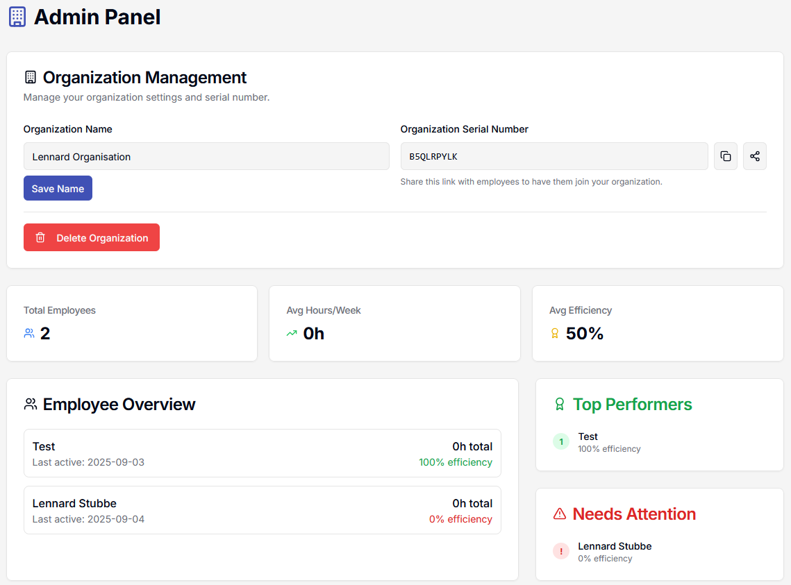
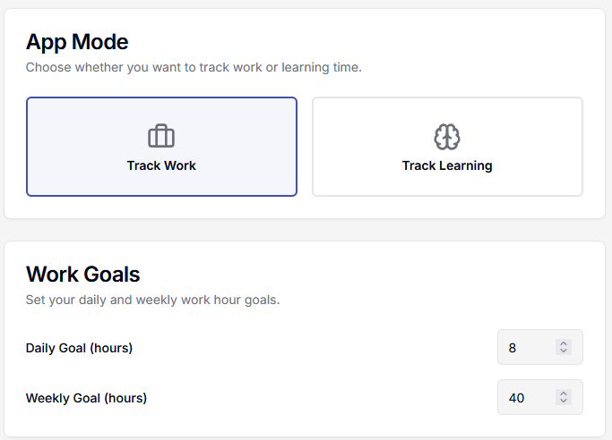
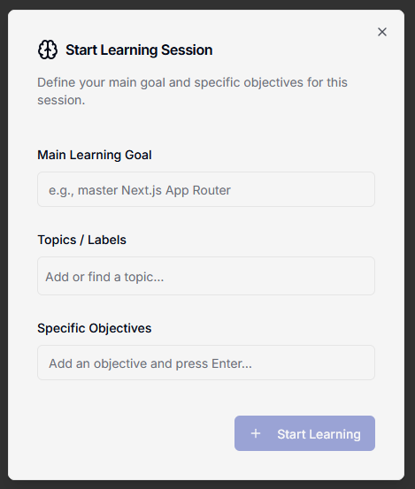
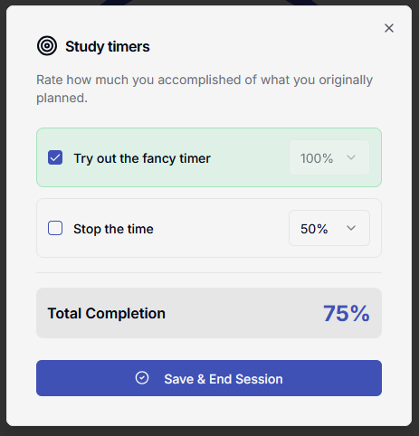
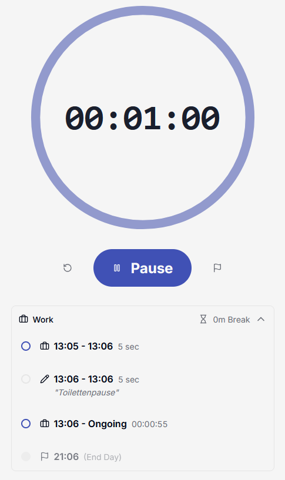
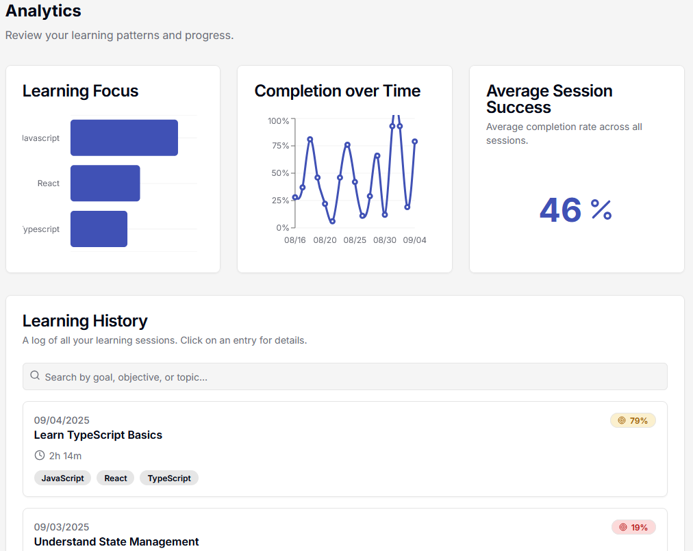
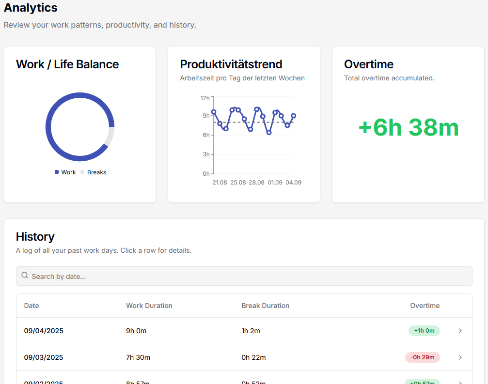

# Timeflow

<!-- App Icon -->

  

## 📝 Description
Tiemflow is a modern timer designed to track work and study sessions efficiently and clearly.  
With a simple, intuitive interface optimized for both **desktop** and **mobile**, you can start, pause, and stop timers within seconds.  

The **analytics page** gives you detailed insights into your work or study habits, helping you achieve your long-term goals.  
Tiemflow supports both **English and German** as well as **light and dark themes** for a pleasant user experience.  

For **companies and educators**, Tiemflow includes an **admin feature** that allows you to invite team members or students into an organization, giving you a clear overview of their work and learning progress.  

---

## ✨ Key Features
- *Quick Timer*: Start, pause, and stop your sessions with just a few clicks.  
- *Analytics Page*: Get detailed statistics about your sessions to track your progress.  
- *Cross-Platform*: Optimized for desktop and mobile.  
- *Multilingual*: Supports English and German.  
- *Themes*: Choose between light and dark mode.  
- *Admin Functionality*: For companies and educators – invite team members or students and monitor their progress.  

---

## 🚀 Development Status
- [x] Core features implemented  
- [ ] Improve encryption  
- [ ] Fix potential bugs  

---

## 🖼️ Screenshots

### Admin & Modes

  
  

### Learning Mode

  
  

### Timer

  

### Analytics

  
  

---

## 🌐 Links
- [🌍 Official Website](https://timeflow.leshift.de/)

---

## 👤 Developer
- Lennard Stubbe ([GitHub](https://github.com/LS-Studios))

---

## ⚖️ License
This project is licensed under the **MIT License**.  
See [LICENSE](LICENSE) for details.